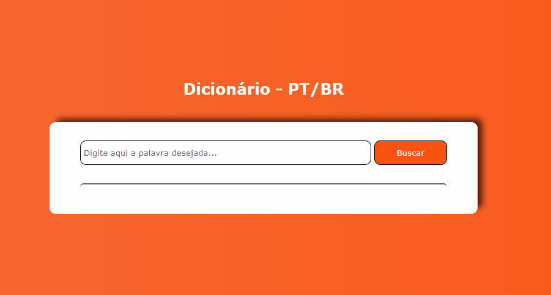

## Dicionário PT/BR 
### Desenvolvido com HTML, CSS e JS.

    
    
    

### Vídeo ensinando detalhadamente como criar este projeto:
https://www.youtube.com/watch?v=AXWeql6xj88&t=1187s

### Este projeto permite que seja inserido no input de texto qualquer palavra em português, a partir do momento que é clicado no botão buscar dois significados para ela surgem na parte inferior.

 
    

### Caso no input texto não seja inserida nenhuma palavra e o usúario clique no buscar, uma mensagem sinalizando para que preencha corretamente o campo surgirá na tela.

 
    

### Da mesma forma se o úsuario inserir uma palavra que não conste no dicionário PT/BR uma mensagem de aviso também aparecerá.

 
    

### Para desenvolver este projeto foi necessário utilizar a API https://github.com/ThiagoNelsi/dicio-api.

